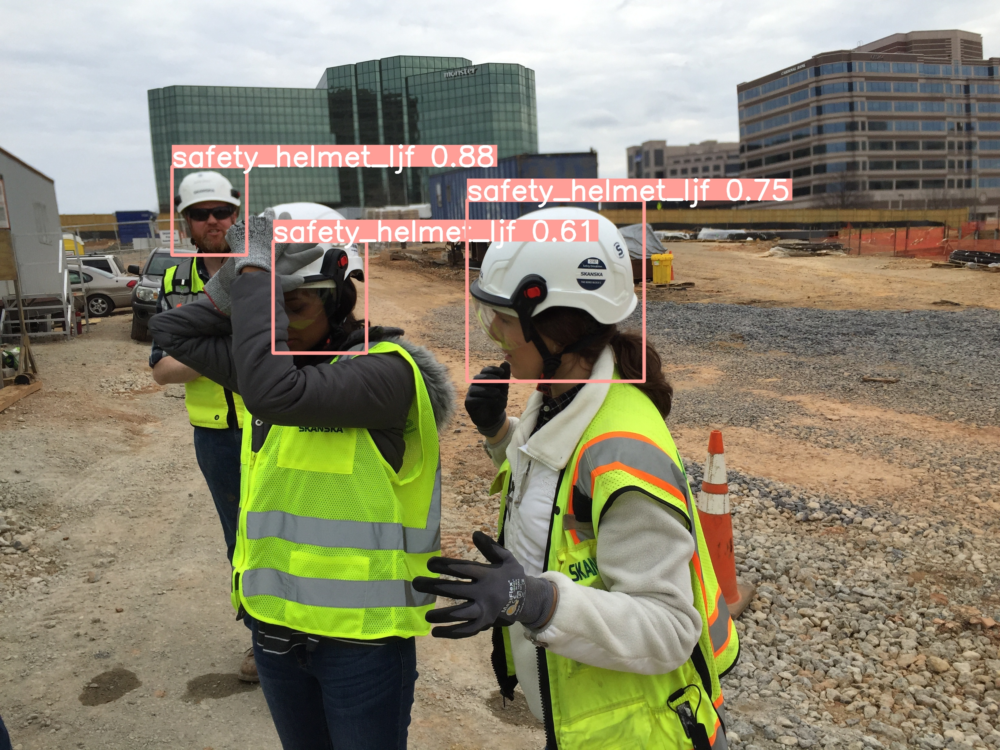

# safety_helmet_detector-by-yolov8
  This is a project trying to detect the safety-helmet by using Yolov8.
## Model 1: 50 imgs
  Since this model is absolutely overfitting, I would just show the confusion matrix in the following. This is just a beta model to experience the process of a cv detection work. For the labeling step, I just simply use the cvat.ai.
  
  The confusion matrix is like the following picture:
  
  

## Model 1: 1700 imgs
  ### Dataset
  - website : https://www.kaggle.com/datasets/vodan37/yolo-helmethead (which has two types of label, one is safety_helmet, another one is simply just head (without safety_helmet))
  - data selection: I just literally simplified the natural 20000+ imgs to 1700 pics, and use 300 pics as the validation set.

  ### Model Selection
  - The official yolo v8 website offered plenty of models to select, however, in this project, I just used yolov8-nano (20 epochs, 50 epochs, 100epochs), yolov8-nano-pretrained (50 epochs) and yolov8-small-pretrained (50 epochs) as the training model (totally 5 models).
  - official docs website of yolov8: https://docs.ultralytics.com/

  ### Envs.
  - Autodl platform with a single RTX-3080, the envs is Pytorch 1.10.0, python 3.8(ubuntu20.04)

  ### Training Process:
  - yolov8-nano, 20 epochs
    
    - Confusion Matrix(Normalized):
      
      
  - yolov8-nano, 50 epochs
    
    - Confusion Matrix(Normalized):
      
      
  - yolov8-nano, 100 epochs
    
    - Confusion Matrix(Normalized):
      
      
      
  - yolov8-nano-pretrained, 50 epochs
    
    - Confusion Matrix(Normalized):
      
      
      
  - yolov8-small-pretrained, 50 epochs
    
      - Confusion Matrix(Normalized):
        
      
    
  - All the training code in this part were uploaded to the model_kaggle_1700 folder.

  ### Results
  For testing dataset, let us see how each model performed on the certain picture:
  #### pic_2292
  - yolov8-nano, 20 epochs:
    
    
    
  - yolov8-nano, 50 epochs:
    
    
    
  - yolov8-nano, 100 epochs:
    
    
    
  - yolov8-nano-pretrained, 50 epochs:
    
    
    
  - yolov8-small-pretrained, 50 epochs:
    
    

  What about during the same epochs, different models' performance:
  #### pic_2116 (with 2 helmet label and 1 head label)
  
  - yolov8-nano, 50 epochs:
    
    
    
  - yolov8-nano-pretrained, 50 epochs:
    
    
    
  - yolov8-small-pretrained, 50 epochs:
    
    

  ### GIF Version
  - original:
    
    
  - yolov8-nano, 50 epochs:
    
    
  - yolov8-nano-pretrained, 50 epochs:
    
    
  - yolov8-small-pretrained, 50 epochs:
    
    

    That's it! It's just for fun orz

  
